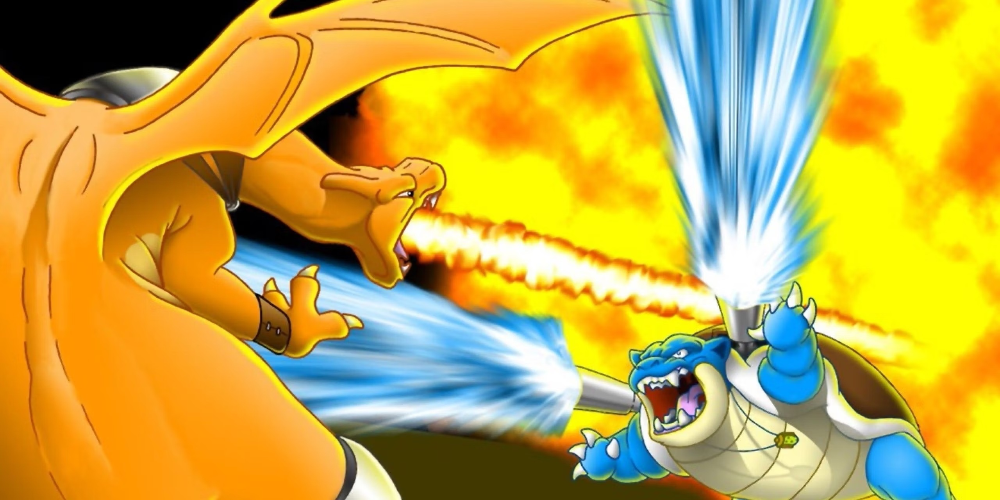

# Démarrage

1.  Reprends ton dossier `basics`
2.  Crée un fichier : `functions.php` à la racine du dossier `basics`
3.  Inclus ton fichier `functions.php` dans `index.php`.
4.  Démarre un serveur HTTP.

## Fonction

1.  Crée une fonction nommée `sayHello` permettant d'écrire _"Hello Bulbi"_.
2.  Appelle ta fonction dans ton fichier `index.php` afin de la tester.

## Return

*   Une fonction **ne doit jamais** (sauf cas rare) afficher directement quelque chose (echo, print\_r, var\_dump...).  
    
*   **Une fonction doit retourner une valeur d'un type bien défini.**

En ré-utilisant notre fonction `sayHello()`

1.  Modifie la fonction pour qu'elle **retourne** "Hello Bulbi" plutôt que de l'afficher directement.
2.  Cette fonction ne doit pouvoir retourner que des chaînes de caractère.

## Paramètre

Toujours à partir de ta fonction `sayHello()`

1.  Modifie la en lui ajoutant un paramètre nommé `name` de **type string**
2.  Modifie la fonction pour qu'elle retourne _"Hello \[NAME\]"_
3.  Rend le paramètre `name` **optionnel**. Si rien n'est précisé, ta fonction devra retourner "Hello Bulbi"

## Conclusion

[Comment créer une fonction ?](function_cheatsheet.html)

1.  Crée une nouvelle fonction nommée `fight`, cette fonction retournera une chaîne. Cette fonction va nous permettre de faire combattre deux Pokemon l'un contre l'autre.
2.  Elle prendra donc trois paramètres : `pokemon1` de type **string** et `pokemon2` de type **string** et enfin ton tableau contenant la liste des Pokemon par type.
  
Petit rappel :

*   **Type Plante** : Bulbizarre, Mystherbe, Chetiflor
*   **Type Eau** : Carapuce, Stari, Magicarpe
*   **Type Feu** : Salamèche
*   **Type Sol** : Sabelette, Taupiqueur

  
6.  Algo : Le type Feu l'emporte contre le type Plante. Le type Plante l'emporte contre le type Eau. Le type Eau l'emporte contre le type Feu.  
    En prenant cela en compte, cherche à quel type appartient les deux Pokemon fourni en paramètre.
7.  Retourne "\[POKEMON\_NAME\] a gagné contre \[POKEMON\_NAME\]" en remplacant les deux champs par les valeurs des Pokemon gagnant et perdant.
8.  Si les deux Pokemon sont du même type, il y a match nul  
      
    Indice 1 : Il faudra surement d'abord récupérer le type de chaque pokemon afin de trouver le gagnant.  
    Indice 2 : La fonction [in\_array](https://www.php.net/manual/fr/function.in-array.php) te sera sûrement utile.  
      
    
9.  BONUS : Nous répétons du code lorsque nous voulons récupérer le type de chaque pokemon. La création d'une fonction à réutiliser serait peut être une bonne idée.

